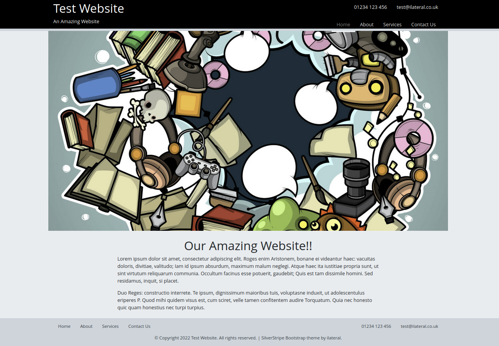

# Silverstripe Bootstrap4 Theme

A simple SilverStripe theme built using Bootstrap 4 and webpack and styled
similarly to the default `silverstripe/simple-theme`.

## Apperance



## Install

Install via composer:

    # composer require "ilateral/silverstripe-bootstrap-4"

## Featured Images

All page templates support `$FeaturedImage` by default (to act as a hero
image/banner).

You can either add a `FeaturedImage` to your page, or rely on a module,
such as `i-lateral/silverstripe-featuredimage`

## Banner Images / Titles

This theme loads the title, breadcrumbs and any featured
images into a `Banner` include. This means you can 
breakout and style the banner seperatly to the main site
`Layout`

You can also make the banner span the full width of the 
site by adding `FullWidthBanner` to true in your Pages
or Controllers, eg:

```PHP
class PageController extends ContentController
{
    public function getFullWidthBanner()
    {
        return true;
    }
}
```
## Page `Layout`

As more complex websites need more sophisticated markup, 
the `$Layout` variable is broken out into a seperate 
include (called from `Page.ss` master template).

This allows the layout to be overwritten and altered
without having to make changes to the core `Page.ss`
master template (which allows for a slightly smoother
upgrade path)

## Webpack

Core CSS/JS is transpiled and minified via webpack and all bootstrap classes
are injected into the webpack bundle.

If you want to make use of webpack you will need to install [Yarn](https://yarnpkg.com/getting-started)

### Edit This Theme Directly

If you are not using version control (eg: git) or have added this theme to your
project's repo directly work with this theme. First navigate to the theme directory:

    # cd /path/to/my/project/themes/bootstrap

Now install dependencies:

    # yarn install

This will add `node_modules` to your theme and you can transpile dependencies using webpack:

    # yarn dev
    # yarn build

### Using a Sub Theme

As of SilverStripe 4 you can use a sub theme to extend this theme, and you can use webpack
to include SCSS/JS from this theme in your own custom theme.

**Step 1: Create your theme**
Start off creating a theme with this structure (you can copy package.json and webpack.*.js
out of the parent theme):

    /themes/custom
        - src
            - javascript
                - script.js
            - scss
                - _variables.scss
                - mystyles.scss
                - bundle.scss
                - editor.scss
        - package.json
        - webpack.common.js
        - webpack.dev.js
        - webpack.prod.js

**Step 2: Install dependencies**
As above, you must run the following:

    # cd /path/to/project/themes/custom
    # yarn install

**Step 3: Setup your Bundle and/or Editor**
In `bundle.scss` you can import you own variable overwrites, and custom styles and
bring them inline with the parent theme's by adding something like this:

`themes/custom/src/scss/bundle.scss`
```scss
@import "../../node_modules/bootstrap/scss/functions";

@import "global/fonts";
@import "global/variables";

/**
 * Parent theme includes. Enable, re-name as required
 * to custom parent theme
 */
//@import '../../../[THEME]/src/scss/global/variables';

@import "../../node_modules/bootstrap/scss/variables";

/**
 * Import core bootstrap modules (only two provided as an example)
 */
@import "../../node_modules/bootstrap/scss/mixins";
@import "../../node_modules/bootstrap/scss/root";

/**
 * Parent theme imports (enable, re-name as required)
 */
@import '../../../[PARENTTHEME]/src/scss/global/typography';
@import '../../../[PARENTTHEME]/src/scss/global/global';
@import '../../../[PARENTTHEME]/src/scss/global/header';
@import '../../../[PARENTTHEME]/src/scss/global/body';
@import '../../../[PARENTTHEME]/src/scss/global/footer';
@import '../../../[PARENTTHEME]/src/scss/global/misc';
@import '../../../[PARENTTHEME]/src/scss/layout/homepage';

/**
 * Import custom styles
 */
@import "mystyles.scss";
```

**NOTE You may want to also add something similar to toyr `editor.scss`**

**Step 4 (optional): Add JS**
If you need to add custom Javascript, you can either add it to your theme's
`script.js` or add additional JS files. 

**Step 4: Check Webpack Config**
The theme's webpack config wil be used to transpile and minify all the SCSS/JS.

For the most part, you shouldn't need to change this, but if you add new JS files or
make more complex changes you might need to update mappings

**Step 5: Run a build**
Once everything is ready, you can transpile and minify your CSS/JS. You can do this via:

    # yarn dev

OR

    # yarn build

`yarn dev` is quick, performs less checks and doesn't minify, good for development.

`yarn build` performs linting and also minifies compiled code.